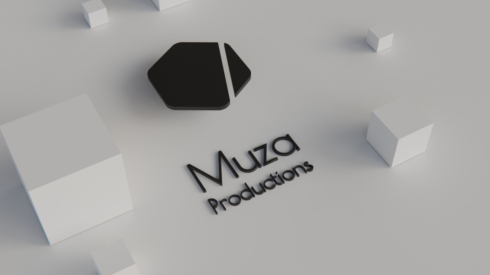

# Muza Productions

## Transforming Scientific Complexity into Visual Clarity

## Who We Are

Muza Productions is a specialized scientific animation studio creating high-end visualizations for academic researchers. We work exclusively with leading scientific teams to transform breakthrough research into compelling visual narratives that enhance understanding among academic peers.

### Our Philosophy

> "The feeling of understanding is just as important as the understanding itself."

We believe that effective scientific communication balances technical accuracy with intuitive comprehension. Our animations don't just present information—they create an experience that makes complex concepts feel accessible while preserving their scientific integrity.

## Our Services

### Strategic Animation
Traditional animation reimagined for academic impact:
- Peer-to-peer scientific communication
- Conference and publication visuals
- Academic presentation integration
- Research methodology visualization

### Interactive Experiences
Novel approaches to research visualization:
- User-paced concept exploration
- Interactive experimental setups
- Web integration solutions
- Visual data interaction

## Our Process

1. **Discovery**: We thoroughly explore your research to understand its significance and challenges
2. **Concept Development**: Translating complex ideas into visual narratives
3. **Visualization**: Creating animations that balance detail with clarity
4. **Refinement**: Ensuring scientific accuracy while maintaining engagement
5. **Delivery**: Providing optimized assets for multiple platforms

## Working With Us

We collaborate with:
- Principal Investigators
- Research Group Leaders
- Department Heads
- Grant Recipients
- Authors in prestigious journals

Our clients include researchers from Princeton University, Weizmann Institute of Science, and Westlake University.

## Connect With Us

- 🌐 [Website](https://www.muza.productions)
- 📧 [Contact](mailto:gabriele@muza.productions)
- 📱 [LinkedIn](https://www.linkedin.com/company/muza-productions)
- 🎬 [YouTube](https://youtube.com/@muza-productions?si=BevyOzwF48USYrnt)

---

*"People won't remember what you said, they remember how you made them feel."*
